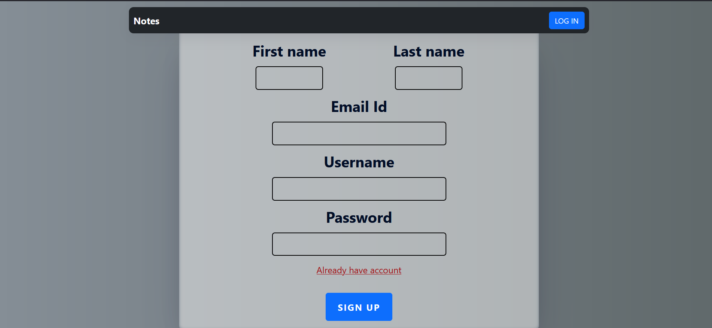
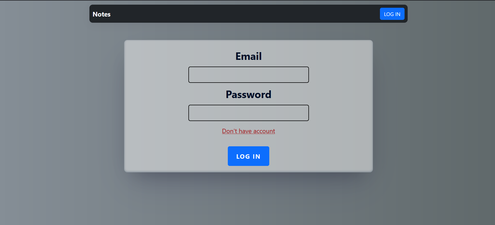
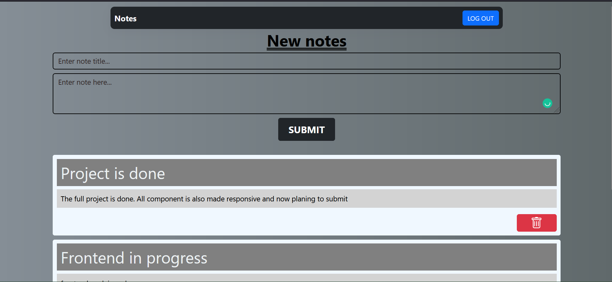
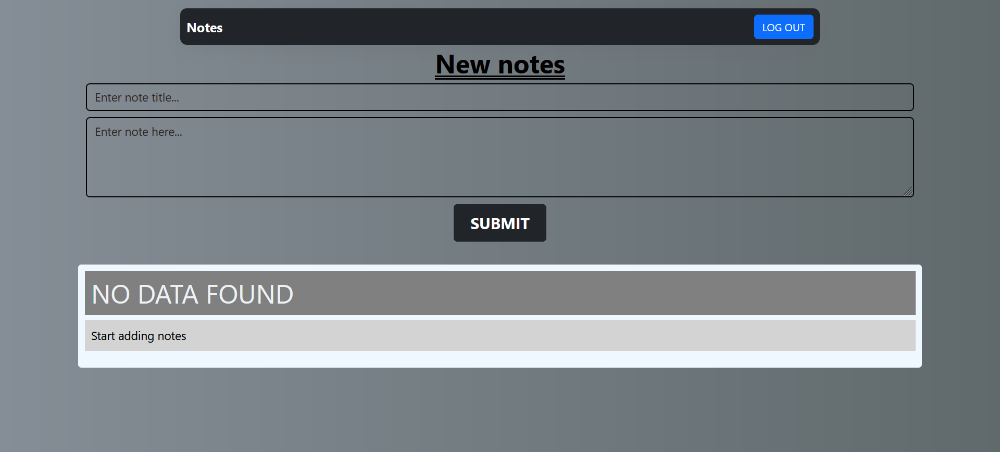
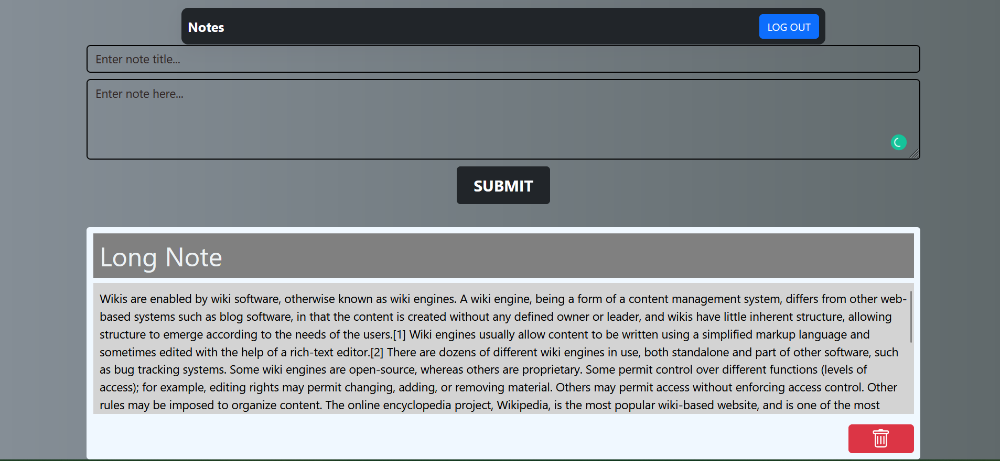

# notes-app
This is a solo reactjs and nodejs full stack web app. In this user have to login with his login credential and your will be directed to text area page. On text page user can add any note and below text area user can see his/her all notes.

## Steps to run application on local server

* Clone this repository locally than to following for starting local server for backend or frontend.
  
* <kbd>npm start</kbd> ==> To start backend server go to Backend folder and then run this command to start bandend nodejs server.
 
* <kbd>npm run dev</kbd> ==> To start reactjs server go to Frontend folder and then run this command to start reactjs server and then go to http://localhost:5173/
<hr/>

## TechStacks
```
Frontend :- HTML | CSS | Javascript | Reactjs | React-Redux | Redux-Thunk | React-Bootstrap | React-Router

Backend :- Nodejs | Express | MongoDB | Mongoose | cors | jsonwebtoken | bcryptjs 
```
<hr/>

# Frontend

* ##  Register new user 


* ## Login with user of email and password


* ##  Notes page


* ##  If user not added any notes


* ##  Long notes


<hr />
Thank you ❤️
